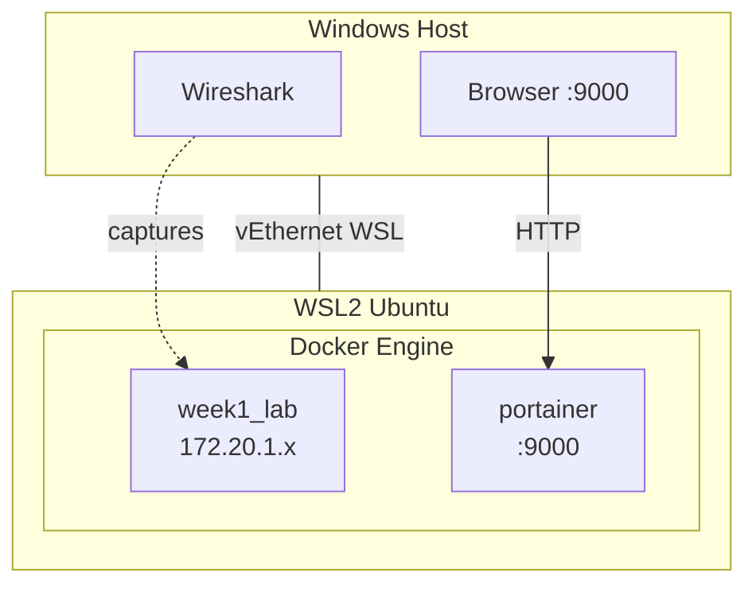

# Docker Lab Architecture



## Components

### Windows Layer
- Wireshark: Capture on vEthernet (WSL)
- Browser: Portainer at localhost:9000

### Docker Containers

| Container | Purpose | Port |
|-----------|---------|------|
| week1_lab | Lab exercises | 9090-9092 |
| portainer | Docker UI | 9000 (RESERVED) |

## Network

```yaml
Network: week1_network
Subnet: 172.20.1.0/24
Gateway: 172.20.1.1
```

## Traffic Flow

1. Exercise runs in week1_lab
2. Traffic through Docker bridge
3. Wireshark captures on vEthernet (WSL)
