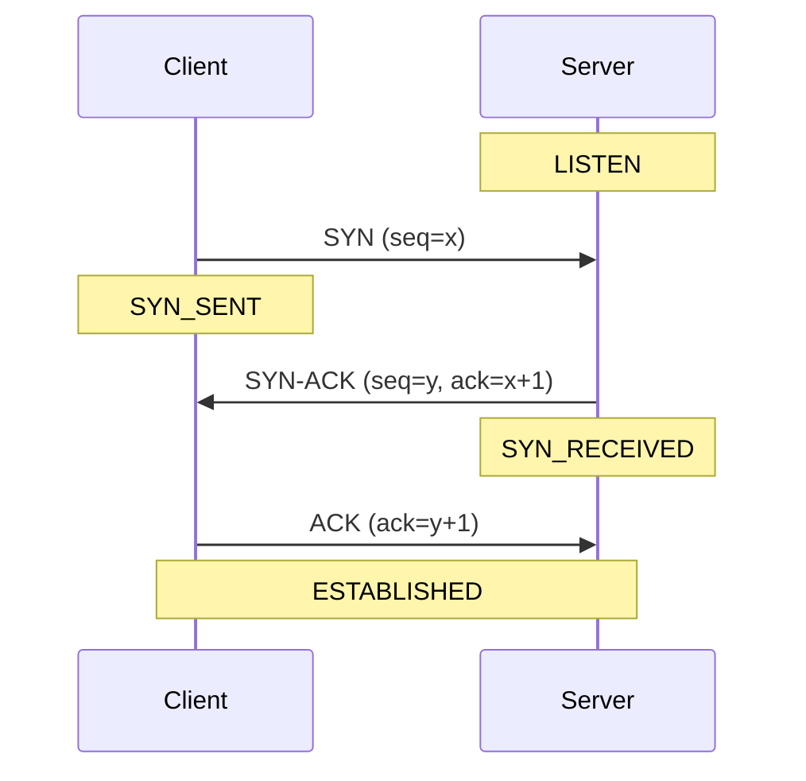

# TCP Three-Way Handshake



## Handshake Steps

| Step | Packet | Direction | Purpose |
|------|--------|-----------|---------|
| 1 | SYN | Client → Server | Request connection |
| 2 | SYN-ACK | Server → Client | Accept |
| 3 | ACK | Client → Server | Confirm |

## Socket States

| State | Meaning |
|-------|---------|
| LISTEN | Waiting for connections |
| SYN_SENT | Sent SYN, waiting |
| ESTABLISHED | Connected |
| TIME_WAIT | Closed, waiting |

## Wireshark Filters
```
tcp.flags.syn == 1              # SYN packets
tcp.flags.syn == 1 && tcp.flags.ack == 0  # Initial SYN only
tcp.flags.fin == 1              # Connection close
```
