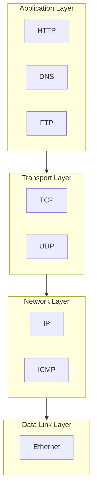

# TCP/IP Layer Model

## Layer Functions

| Layer | Protocols | Function |
|-------|-----------|----------|
| Application | HTTP, DNS, FTP | User services |
| Transport | TCP, UDP | End-to-end delivery |
| Network | IP, ICMP | Addressing, routing |
| Data Link | Ethernet | Local delivery |

## LO Coverage
- LO1: ICMP (ping)
- LO2: TCP (sockets)
- LO4: All layers (PCAP)
