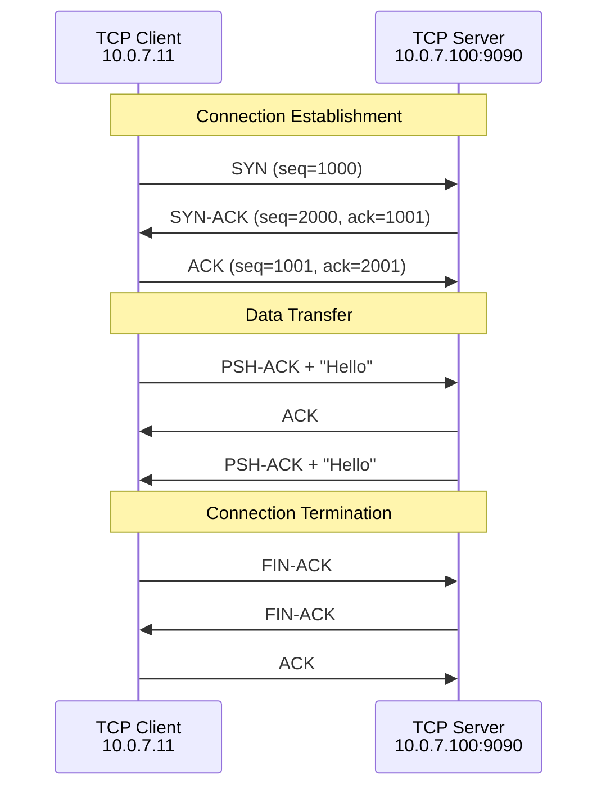
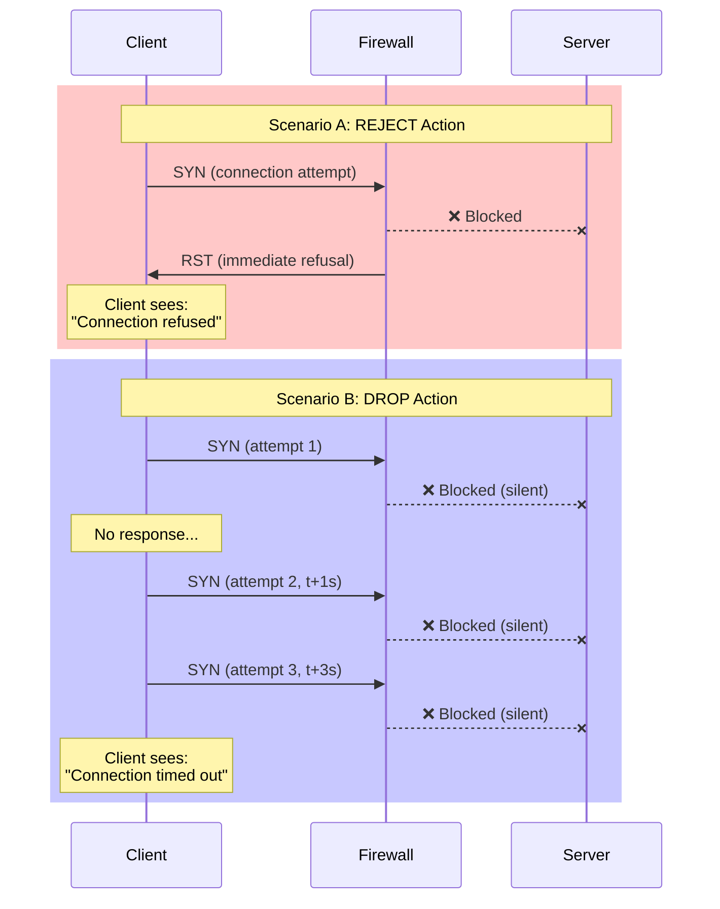
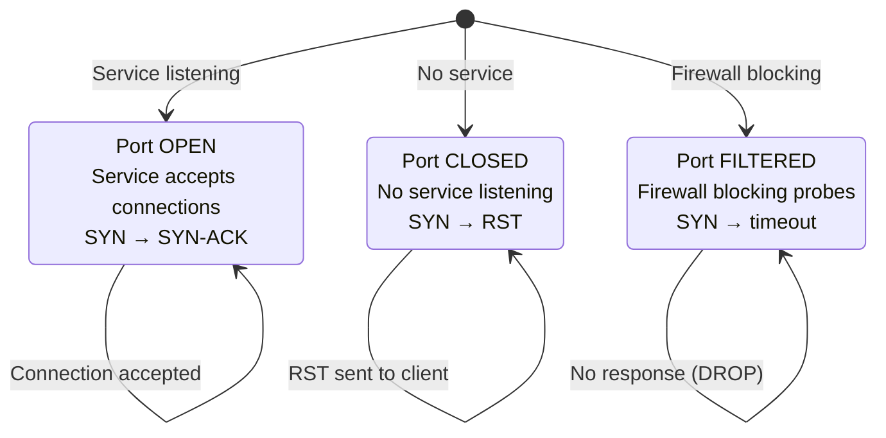
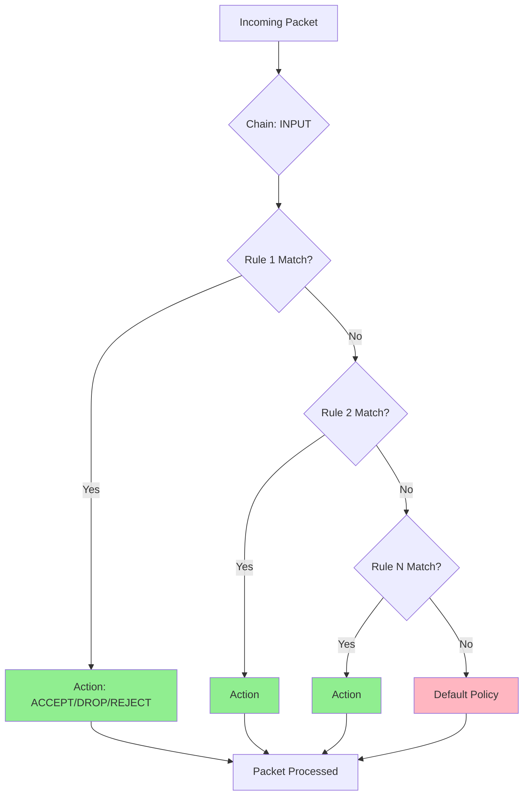
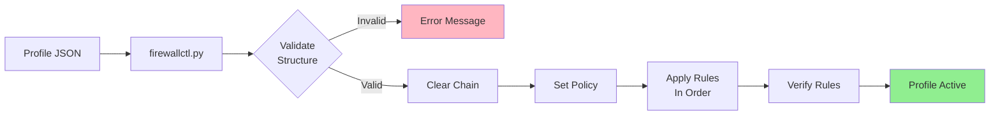
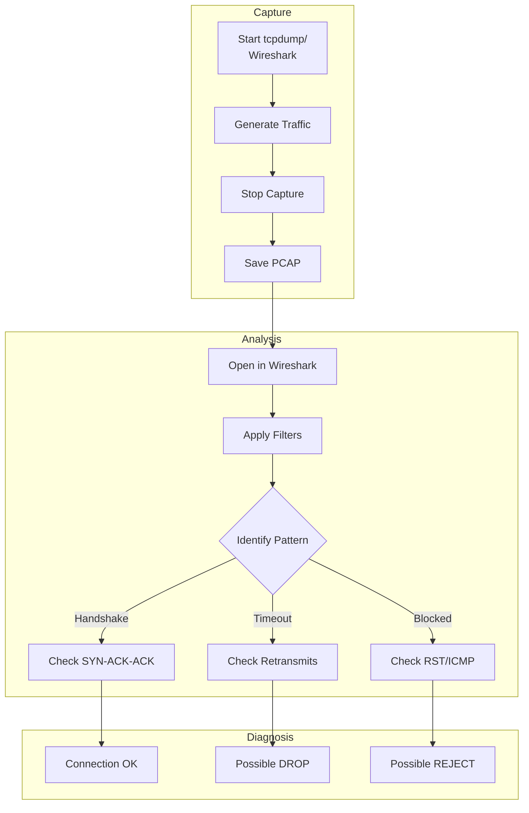
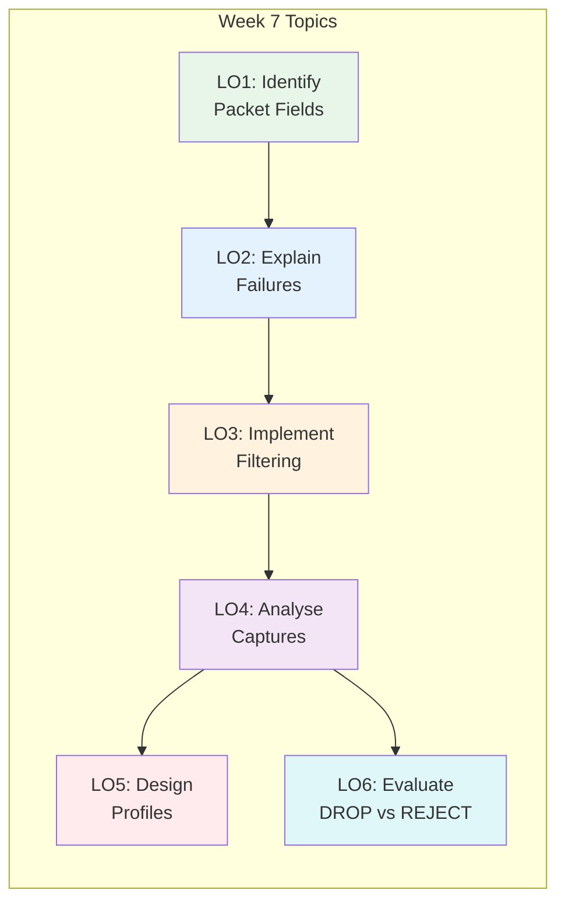

# 📊 Architecture Diagrams — Week 7
## Computer Networks — ASE, CSIE | Computer Networks Laboratory

> Visual diagrams illustrating key concepts for packet interception, filtering
> and defensive port probing.

---

## Lab Environment Architecture

```mermaid
graph TB
    subgraph Windows Host
        W[Wireshark]
        P[Portainer :9000]
    end
    
    subgraph WSL2
        subgraph Docker Network 10.0.7.0/24
            TS[TCP Server<br/>10.0.7.100:9090]
            TC[TCP Client<br/>10.0.7.11]
            UR[UDP Receiver<br/>10.0.7.200:9091]
            US[UDP Sender<br/>10.0.7.12]
            FW[Packet Filter<br/>10.0.7.50:8888]
        end
        TD[tcpdump]
    end
    
    W -.->|vEthernet WSL| TD
    P -.->|Docker API| Docker Network
    TC -->|TCP :9090| TS
    US -->|UDP :9091| UR
    TC -.->|via| FW
```

---

## TCP Three-Way Handshake



---

## DROP vs REJECT Comparison



---

## Port States



---

## iptables Rule Processing



**Key Concept:** First match wins. Rule order matters!

---

## Firewall Profile Application Flow



---

## Packet Capture Analysis Workflow



---

## Learning Path



---

## Viewing These Diagrams

### Option 1: GitHub/GitLab
Mermaid diagrams render automatically in Markdown files on GitHub and GitLab.

### Option 2: VS Code
Install the "Markdown Preview Mermaid Support" extension.

### Option 3: Online
Copy diagram code to [mermaid.live](https://mermaid.live/) for interactive editing.

### Option 4: Export as Images
```bash
# Using mermaid-cli
npm install -g @mermaid-js/mermaid-cli
mmdc -i docs/diagrams.md -o docs/images/diagram.png
```

---

*Computer Networks — Week 7: Packet Interception, Filtering and Defensive Port Probing*  
*ASE Bucharest, CSIE | Computer Networks Laboratory*
