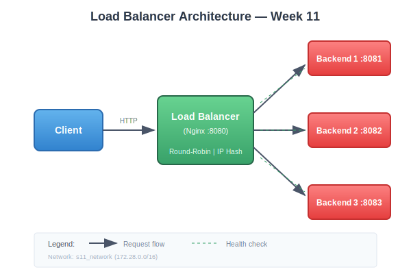
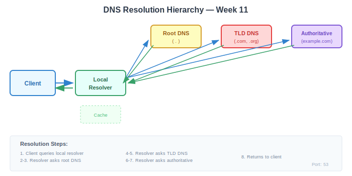

# 📸 Images Directory — Week 11
## Computer Networks — ASE, CSIE | by ing. dr. Antonio Clim

> Diagrams and visual aids for Week 11 laboratory exercises.

---

## Available Diagrams

| Filename | Description | Format | Size |
|----------|-------------|--------|------|
| `load_balancer_architecture.svg` | Overview of LB topology with Nginx and backends | SVG | ~4KB |
| `dns_resolution_flow.svg` | DNS query hierarchy and resolution steps | SVG | ~5KB |

---

## Diagram Descriptions

### Load Balancer Architecture



**Shows:**
- Client → Nginx Load Balancer → Backend Servers (1-3)
- Request flow arrows
- Health check indicators (dashed)
- Network configuration (s11_network)
- Port mappings (8080, 8081-8083)

**Use for:**
- Understanding lab topology
- Explaining reverse proxy concept
- Visualising health check mechanism

### DNS Resolution Flow



**Shows:**
- Client → Local Resolver → Root → TLD → Authoritative
- Query (blue) and response (green) arrows
- Step numbering (1-8)
- DNS port notation (53)
- Cache indication

**Use for:**
- Understanding iterative resolution
- Explaining DNS hierarchy
- Visualising resolution latency

---

## Adding New Diagrams

When adding diagrams:

1. **Format preferences:**
   - SVG for diagrams (scalable, small file size)
   - PNG for screenshots (max 500KB)

2. **Naming convention:**
   - Lowercase with underscores
   - Descriptive names
   - Example: `ftp_dual_connection.svg`

3. **Colour palette (for consistency):**
   - Blue (`#3182ce`) — Client/Request
   - Green (`#38a169`) — Response/Success
   - Red (`#e53e3e`) — Backend/Server
   - Yellow (`#d69e2e`) — Warning/Caution

4. **Update this README** with new diagram entry

---

## Suggested Additional Diagrams

| Filename | Description | Priority |
|----------|-------------|----------|
| `ftp_dual_connection.svg` | FTP control vs data channels | Medium |
| `ssh_tunnel_diagram.svg` | SSH port forwarding visualisation | Medium |
| `round_robin_sequence.svg` | Round-robin distribution animation | Low |
| `health_check_comparison.svg` | Passive vs active health checks | Low |

---

## Usage in Documentation

Reference diagrams in Markdown:

```markdown

```

For HTML presentations:

```html

```

---

*NETWORKING class - ASE, Informatics | Computer Networks Laboratory*  
*Week 11: Application Protocols — FTP, DNS, SSH and Load Balancing*
