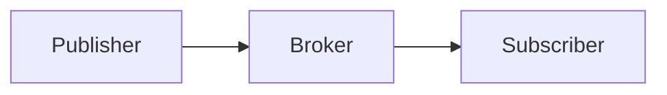

# 📁 Images Directory — Week 13

> Storage location for diagrams and visual resources.

---

## Purpose

This directory contains visual resources for the Week 13 laboratory:
- Architecture diagrams
- Protocol flow visualisations
- Screenshot references

## Diagram Files

| File | Description |
|------|-------------|
| `architecture_week13.md` | Mermaid diagram of laboratory architecture |

## Creating Diagrams

For new diagrams, use [Mermaid](https://mermaid.js.org/) syntax in Markdown files. These render automatically on GitHub and in most Markdown viewers.

Example:

## Exporting to Images

If static images are needed:
1. Use the [Mermaid Live Editor](https://mermaid.live/)
2. Paste the diagram code
3. Export as PNG or SVG
4. Save to this directory with descriptive names

## Naming Convention

- Use lowercase with underscores: `mqtt_flow_diagram.png`
- Include week number for context: `week13_architecture.svg`
- Add version if updating: `network_topology_v2.png`

---

*Computer Networks — Week 13: IoT and Security*
*ASE Bucharest, CSIE | by ing. dr. Antonio Clim*
