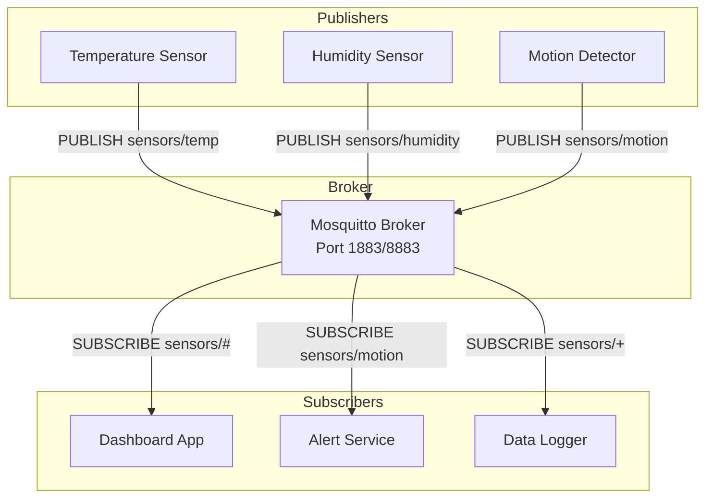
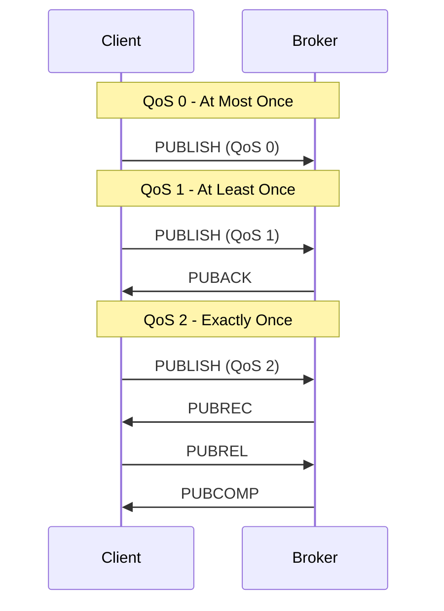
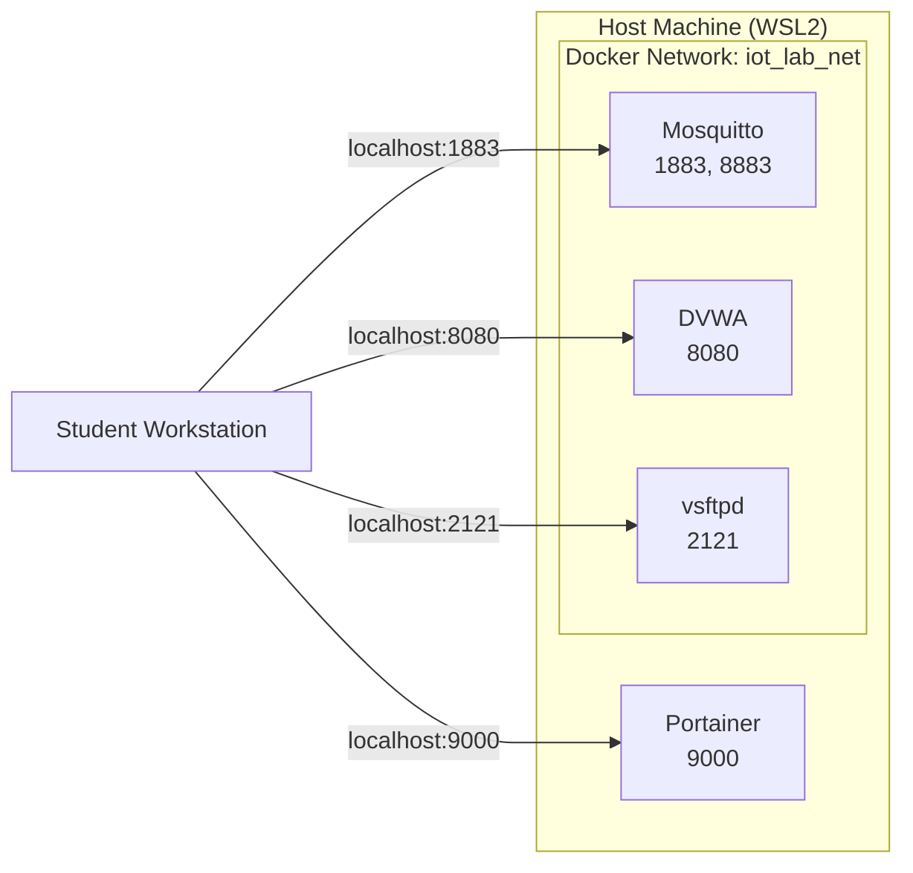
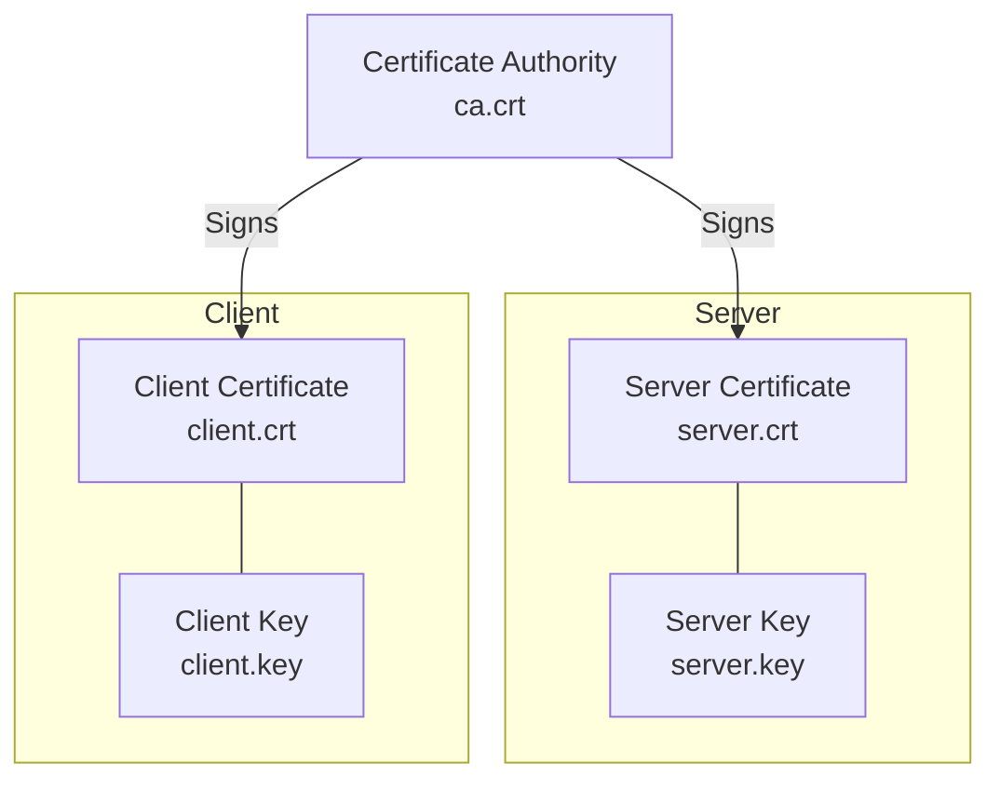
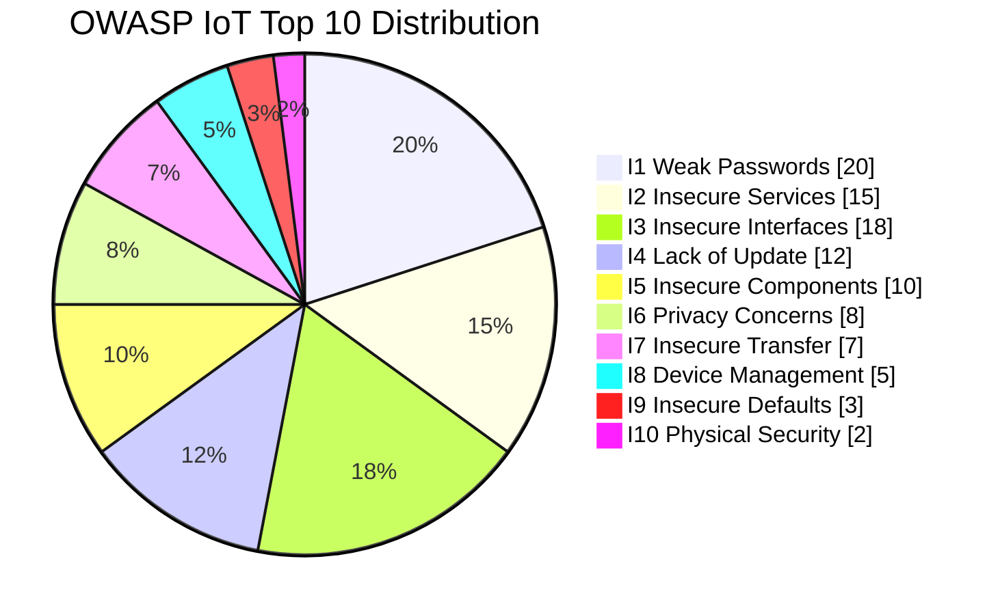
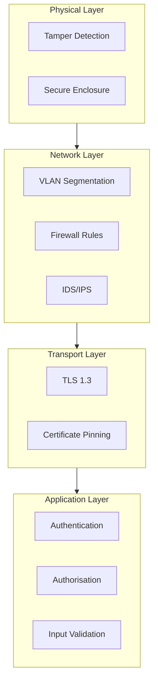
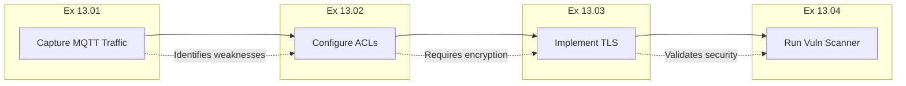

# Week 13: Architecture Diagrams

**Computer Networks** — ASE, CSIE | ing. dr. Antonio Clim

This document contains Mermaid diagram definitions for Week 13 IoT and Security materials.

---

## 1. MQTT Publish-Subscribe Architecture



---

## 2. MQTT QoS Handshakes



---

## 3. Laboratory Environment Topology



---

## 4. TLS Certificate Chain



---

## 5. OWASP IoT Vulnerability Categories



---

## 6. Defence-in-Depth Layers



---

## 7. Exercise Workflow



---

## Usage

These diagrams can be rendered using:

1. **GitHub**: Automatically renders in Markdown files
2. **VS Code**: Install Mermaid Preview extension
3. **Mermaid Live Editor**: https://mermaid.live/
4. **pandoc**: With mermaid-filter for PDF export

### Export to PNG

```bash
# Using mmdc (Mermaid CLI)
npm install -g @mermaid-js/mermaid-cli
mmdc -i architecture_week13.md -o diagram.png -t default
```

---

*Document version: 2.0 | Language: en-GB | Last updated: January 2026*
