# 🏗️ Architecture Diagrams — Week 13

> Visual representations of the laboratory environment and protocol flows.

---

## 1. Laboratory Network Architecture

```mermaid
graph TB
    subgraph Windows["Windows 11 Host"]
        Browser["🌐 Browser"]
        Wireshark["🦈 Wireshark"]
        PS["PowerShell"]
    end
    
    subgraph WSL2["WSL2 Ubuntu 22.04"]
        subgraph Docker["Docker Engine"]
            subgraph Network["week13net (10.0.13.0/24)"]
                Mosquitto["🦟 Mosquitto<br/>10.0.13.100<br/>:1883 (plain)<br/>:8883 (TLS)"]
                DVWA["🎯 DVWA<br/>10.0.13.11<br/>:80 (HTTP)"]
                VSFTPD["📁 vsftpd<br/>10.0.13.12<br/>:21 (FTP)<br/>:6200 (stub)"]
            end
        end
        Portainer["🐳 Portainer<br/>:9000"]
        Scripts["📜 Python Scripts"]
    end
    
    Browser -->|":9000"| Portainer
    Browser -->|":8080"| DVWA
    Wireshark -.->|"capture"| Network
    PS -->|"wsl"| Scripts
    Scripts -->|"docker"| Docker
```

---

## 2. MQTT Publish/Subscribe Flow

---

## 3. Plaintext vs TLS Traffic Comparison

---

## 4. Port Scanner State Machine

---

## 5. TLS Handshake Sequence

```mermaid
sequenceDiagram
    participant C as Client
    participant S as Server (Broker)
    
    Note over C,S: Handshake Phase
    C->>S: ClientHello<br/>(supported ciphers, random)
    S->>C: ServerHello<br/>(chosen cipher, random)
    S->>C: Certificate<br/>(server's public key)
    S->>C: ServerHelloDone
    
    Note over C: Verify certificate<br/>against CA
    
    C->>S: ClientKeyExchange<br/>(pre-master secret)
    C->>S: ChangeCipherSpec
    C->>S: Finished (encrypted)
    
    S->>C: ChangeCipherSpec
    S->>C: Finished (encrypted)
    
    Note over C,S: Encrypted Application Data
    C->>S: 🔒 MQTT CONNECT
    S->>C: 🔒 MQTT CONNACK
```

---

## 6. Vulnerability Assessment Pipeline

---

## 7. QoS Level Comparison

---

## How to Use These Diagrams

1. **In presentations:** Copy Mermaid code to [Mermaid Live Editor](https://mermaid.live/) and export as image
2. **In GitHub:** Mermaid renders automatically in `.md` files
3. **In VS Code:** Install "Markdown Preview Mermaid Support" extension
4. **For print:** Export as SVG for best quality

---

*Computer Networks — Week 13: IoT and Security*
*ASE Bucharest, CSIE | by ing. dr. Antonio Clim*
